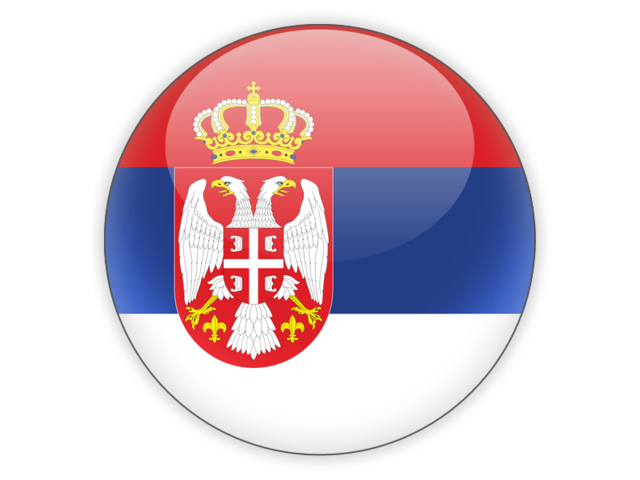
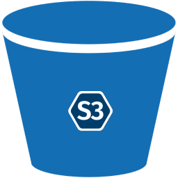

## Hi there 👋, my name is Valerii Linden
#### *contact me*:

## 🙋‍♂️ About me
Hi, I'm a Java Developer with a strong interest in building robust backend systems and continuously growing my skills in Java, Spring Boot, and related technologies. I'm currently focused on writing clean, maintainable code and learning best practices in software architecture, microservices, and DevOps.
I'm open to opportunities where I can contribute to meaningful projects, collaborate with experienced teams, and keep evolving as a developer.

## 🔭 I'm currently working on
### *developing my own project for sharing*:

### *contributing as a volunteer to the development of a platform aimed at supporting the Russian-speaking diaspora in Serbia*:

## 🌱 I’m currently learning

